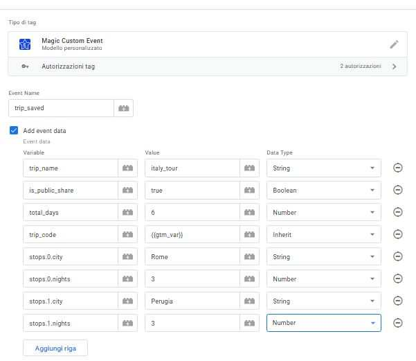
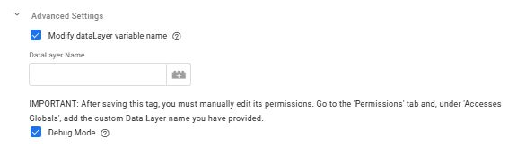

# Magic Custom Event for GTM

A Google Tag Manager Custom Tag Template to push custom events and structured data to the dataLayer. It supports advanced features like data type conversion and the creation of nested objects and arrays via dot notation.

---
## Features

-   **Flexible Event & Data Pushing**: Easily configure and push any event along with a custom set of structured data parameters.
-   **Advanced Data Type Handling**: Specify whether your data is a `String`, `Number`, or `Boolean` or use "Inherit" to preserve the original type from the data source.
-   **Dot Notation Support**: Create complex nested objects and arrays directly from the UI by using dot notation in parameter names (e.g., `ecommerce.items.0.item_name`).

---
## Advaced Settings
-   **Custom Data Layer Support**: Works with websites that use a custom name for the `dataLayer` variable.
-   **Conditional Debug Mode**: Enable detailed console logs for easy troubleshooting.

---
## How to Install

1.  Download the `template.tpl` file from this repository.
2.  Go to your Google Tag Manager container.
3.  Navigate to the **Templates** section and click **New** under "Tag Templates".
4.  Click the three dots menu (⋮) in the top right corner and select **Import**.
5.  Choose the `template.tpl` file you downloaded and save the template.

---
## Configuration

-   **Event Name**: The name of the event to push to the dataLayer (e.g., `click_and_scroll`).
-   **Add Event Data**: Check this box to add custom parameters to the event.
    -   **Event Parameters Table**:
        -   **Variable**: The key for your data point. Dot notation is supported (e.g., `ecommerce.value`, `ecommerce.items.0.price`).
        -   **Value**: The value for your data point. You can type a static value or insert a GTM Variable.
        -   **Data Type**: Specify the data type for the value.
            -   **Inherit from Variable**: (Default) preserve the original type from the data source. This is the recommended option when using variables.
            -   **String/Number/Boolean**: Forces the value to be converted and validated as the selected type. Use this for static values entered manually.
-   **Advanced Settings**
    -   **Use a custom Data Layer name**: Enable this if your website's Data Layer variable is not named dataLayer. **Note**: After saving, you must manually update the tag's "Accesses Globals" permission to include your custom Data Layer name.
    -   **Enable Debug Mode**: Check this to see detailed raw and processed data logs in the browser's console during testing.

---
## Required Permissions

This template requires the following permission:

-   **Accesses Globals (`dataLayer`)**: Required for pushing the event and its associated data.

---
## License

This project is licensed under the **Apache License 2.0**.
